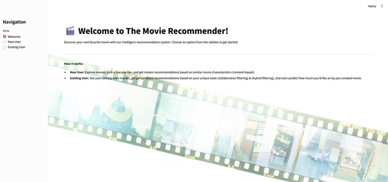
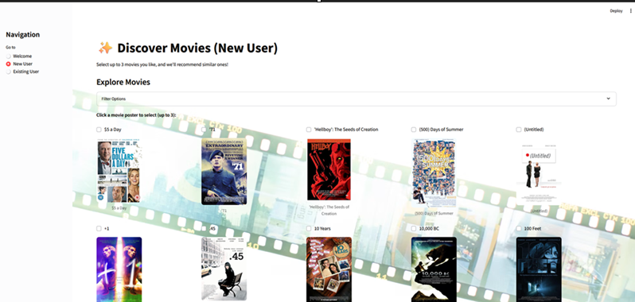
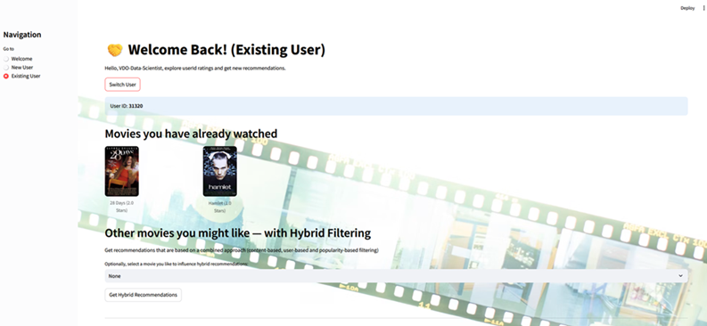

# Movie Recommender System (by using a Streamlit App) 

## Summary

This project involves building a ** movie recommender system** as a Streamlit web app. It recommends movies to both new and existing users based on a combination of **content-based filtering**, **collaborative filtering**, and **popularity-based models**. The app uses real-world movie datasets and offers filtering options, poster visuals, and user session handling.

It’s a great project if you're interested in recommender systems, data pipelines, real-world APIs, and deploying interactive machine learning applications.

---

## Screenshots of Streamlit app

### Welcome page



### New user page



### Existing user page 



---

## Which technologies & tools to use?

### Language
- **Python** 

### Libraries
- **`pandas`** — for data manipulation and preprocessing.
- **`joblib`** — to efficiently save/load DataFrames across notebooks and scripts.
- **`numpy`** — for array operations and generating unique IDs.
- **`surprise`** — to implement collaborative filtering (user-based predictions).
- **`scikit-learn`** — used for modeling, including RandomForest (box office prediction).
- **`streamlit`** — to build and deploy the interactive web app.

### Data Storage
- **joblib** — for fast model/data serialization.
- **csv files** — for storing cleaned or dimensional data.

### Visualization
- **matplotlib** — basic plotting and visual exploration of data.

---

## The different approaches to make predictions

### Content-Based Filtering
- Recommends movies based on similarity in **actors**, **genres**, **directors**, **writers**, and **producers**.
- Uses metadata to find similar titles to those a user already likes.
- Cold Start Handling: This approach is ideal for new users with no prior ratings.

### Collaborative Filtering
- Based on user-user or item-item similarities derived from rating patterns.
- Uses **matrix factorization** via the `surprise` library’s **SVD** algorithm.
- Requires historical user ratings for effective predictions.

### Hybrid Filtering
- Combines the strengths of:
  - **Content-based filtering**
  - **Collaborative filtering**
  - **Popularity-based suggestions**
- Allows more robust and accurate recommendations, especially for users with some but not many ratings.
---

## Data Sources

- [IMDB Datasets](https://www.imdb.com/interfaces/)
- [TMDB API](https://developer.themoviedb.org/docs) 
- [OMDB API](https://www.omdbapi.com/) 
- [MovieLens 100k](https://grouplens.org/datasets/movielens/100k/)

---

## Project Structure Overview

### Data prep. notebooks
- Multiple Jupyter notebooks for **cleaning**, **merging**, and **enriching** data from
  **IMDb**, **TMDB**, **OMDB**, **MovieLens**
- Each source has a dedicated ETL pipeline to create structured and usable datasets.

### Data pipelines
- End-to-end pipelines to **Extract**, **Transform**, and **Load** data into a unified, feature-rich df ready for modeling and recommendations.

### Streamlit application
- **`film_recommender.py`** — contains the core `FilmRecommender` class with all logic.
- **`app.py`** — the main entry point for the **Streamlit web interface**, managing user interaction, navigation, and session handling.


```
├── code/
│   └── notebooks/
│       ├── 01.Imdb_pipeline.ipynb
│       ├── 02.Tmdb_pipeline.ipynb
│       ├── 03.Omdb_pipeline.ipynb
│       ├── ......
│   └── streamlit_app
│       ├── app.py
│       ├── film_recommender.py
│
├── data/
│   └── cleaned/
│       └──  joblib_dataframes/
│            ├── df_final.joblib
│            ├── df_final_matrix.joblib
│            ├── df_movies_combined_rf.joblib
│       └── dim & bridge.csv files
│
│   └── raw/
│       ├── box_office_mapping
│       ├── imdb
│       ├── movielens
│       ├── omdb
│       ├── tmdb

```

---

## Features for Users

- **New Users:** Choose up to 3 favorite movies, get content-based recommendations  
- **Existing Users:** See past ratings, get collaborative and hybrid suggestions  
- **Filter Movies:** Narrow down by actor, genre, director, etc.  
- **Movie Posters:** Dynamically loaded via OMDB API  
- **Session Management:** Random user ID assigned unless chosen manually  

---

## Why you should use this topic?

- Interesting application of machine learning
- End-to-end project experience: data import, cleaning , modeling and deployment. 
- Also a way to learn to work with APIs and user interface logic.

---

## Tips

- Use `.joblib` to save time when loading large datasets
- Explore [Streamlit Docs](https://docs.streamlit.io/) for faster UI development

---

## Credits

*This project was created by Nico Van Steen as part of the Syntra AB Data Scientist course, supervised by Tim Hellemans.*
